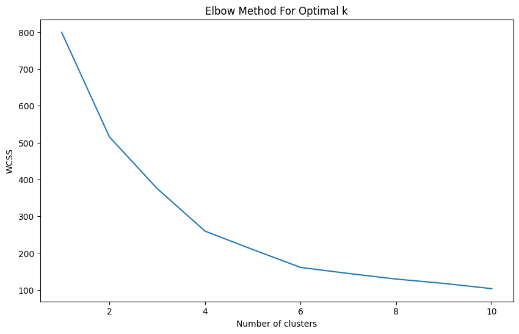
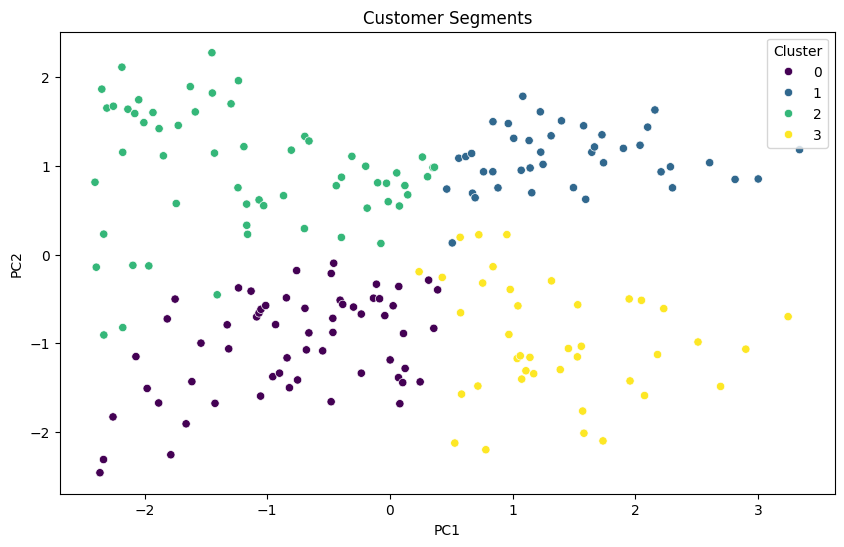

# SCT_ML_2
Machine Learning Task 2 – Customer segmentation
# 🛍 Customer Segmentation Using K-Means

## 📌 Problem Statement  
Implement a **K-Means clustering algorithm** to group customers of a retail store based on their **purchase behavior and characteristics**.  

The goal is to identify distinct customer segments to help businesses **personalize marketing strategies** and **improve customer engagement**.

---

## 📊 Dataset  
We used the **Mall Customers dataset**:  
👉 [Dataset Link](https://www.kaggle.com/datasets/vjchoudhary7/customer-segmentation-tutorial-in-python)  

Selected features for clustering:  
- `Annual Income (k$)`  
- `Spending Score (1-100)`  

Other features like `Age` and `Gender` were used for cluster analysis but numeric features were standardized for the algorithm.

---

## ⚙️ Steps Followed  

1. **Data Loading & Exploration**  
   - Loaded the dataset using **Pandas**.  
   - Checked for missing values and basic statistics.  

2. **Data Preprocessing**  
   - Selected numeric features for clustering.  
   - Standardized data using **StandardScaler**.  

3. **Optimal Cluster Selection**  
   - Applied the **Elbow Method** to determine the optimal number of clusters based on **Within-Cluster Sum of Squares (WCSS)**.  

4. **K-Means Clustering**  
   - Applied **K-Means** algorithm with the selected number of clusters (k=4).  
   - Assigned cluster labels to each customer.  

5. **Visualization**  
   - Reduced data to **2D using PCA** for visualization.  
   - Plotted the customer segments with different colors using **Seaborn**.  

6. **Cluster Analysis**  
   - Calculated the mean values of features for each cluster to understand customer segments.  

---

## ▶️ How to Run the Code  

1. Open the notebook in **Google Colab**.  
2. Upload `Mall_Customers.csv` into Colab’s Files section.  
3. Run all cells sequentially to preprocess data, apply K-Means, and generate visualizations.  

---

## 📈 Results  

- **Elbow Method** plot helped determine the optimal number of clusters.  
- **PCA 2D scatter plot** clearly shows four distinct customer segments.  
- **Cluster summary table** provides insights into the characteristics of each segment, such as average income and spending score.

**Sample Output (Graphs):**  
## 📈 Results

### Elbow Method Plot

### PCA 2D Scatter Plot of Customer Segments

---

## 📦 Tech Stack  
- Python  
- Pandas, NumPy  
- Scikit-learn (KMeans, StandardScaler, PCA)  
- Matplotlib, Seaborn  
- Google Colab  

---

## ✨ Author  
**Kapil**  
📍 CSE (AI & ML), Chitkara University  
